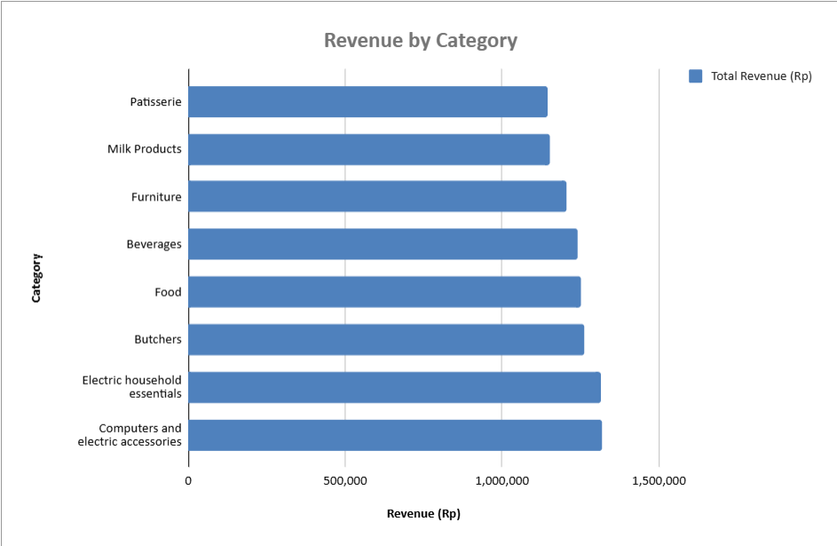
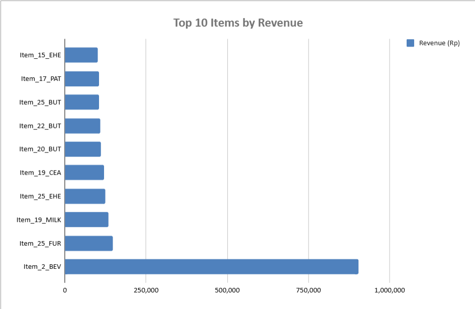
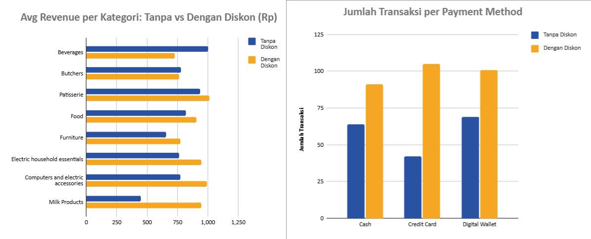
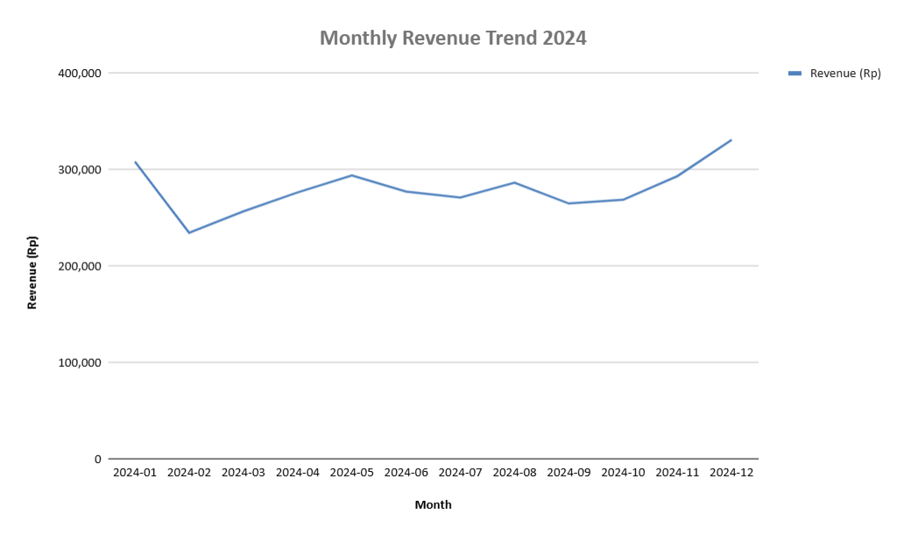

# 🛒 Retail Store — Data Analysis Portfolio

> **End-to-end data analysis project** untuk memahami performa penjualan, pola diskon, dan strategi bisnis perusahaan retail.


---

## 📌 Project Overview

Proyek ini merupakan analisis bisnis lengkap dari dataset transaksi perusahaan retail yang beroperasi secara **Online** dan **In-store**. Analisis mencakup seluruh tahapan data analyst workflow: dari data understanding, cleaning, EDA, hingga business recommendation.

**Tujuan Analisis:**
- Mengidentifikasi kategori produk dan item dengan performa tertinggi
- Memahami efektivitas strategi diskon terhadap revenue
- Menemukan pola tren penjualan bulanan
- Memberikan rekomendasi bisnis berbasis data

---

## 📂 Repository Structure

```
retail-store-analysis/
│
├── data/
│   └── Retail_Store.xlsx          # Dataset utama
│
├── analysis/
│   └── Retail_Store_Dashboard.xlsx  # Excel dashboard & EDA
│
├── dashboard/
│   └── dashboard_preview.png      # Screenshot dashboard
│
├── images/
│   ├── sales_by_category.png
│   ├── top10_items.png
│   ├── discount_analysis.png
│   └── monthly_trend.png
│
├── report/
│   └── Laporan_Analisis.pptx      # Presentasi laporan (6 slide)
│
└── README.md
```

---

## 🗂️ Dataset Description

| Atribut | Detail |
|---|---|
| **Sumber** | Retail Store Internal Transaction Database |
| **Periode** | Januari 2022 – Januari 2025 |
| **Jumlah Baris** | 12.418 transaksi |
| **Jumlah Kolom** | 13 variabel |
| **Unique Customer** | 25 pelanggan |
| **Channel** | Online & In-store |

### Variabel Utama

| Variabel | Tipe | Keterangan |
|---|---|---|
| `transaction_id` | String | ID unik setiap transaksi |
| `customer_id` | String | ID pelanggan (25 unik) |
| `category` | String | Kategori produk (8 kategori) |
| `item` | String | Nama item produk |
| `price_per_unit` | Numerik | Harga per satuan |
| `quantity` | Integer | Jumlah unit dibeli (1–10) |
| `total_spent` | Numerik | Total pengeluaran |
| `payment_method` | String | Cash / Credit Card / Digital Wallet |
| `location` | String | Online / In-store |
| `transaction_date` | Date | Tanggal transaksi |
| `discount_applied` | Boolean | True = ada diskon, False = tidak |
| `Revenue` | Numerik | Pendapatan per transaksi |
| `Month` | Date | Bulan agregasi |

---

## 🔧 Tools Used

| Tool | Kegunaan |
|---|---|
| **Python (pandas, openpyxl)** | Data cleaning & processing |
| **Microsoft Excel** | Dashboard & visualisasi |
| **PptxGenJS** | Pembuatan laporan presentasi |
| **Markdown** | Dokumentasi |

---

## 🧹 Data Cleaning Summary

Berikut langkah-langkah data preparation yang dilakukan:

1. **Pengecekan Missing Value** → Tidak ditemukan missing value pada kolom kritis
2. **Konversi Tipe Data** → Kolom `Revenue`, `total_spent`, `price_per_unit` dikonversi dari `object` ke `numeric`
3. **Format Tanggal** → Kolom `transaction_date` dan `Month` diverifikasi dalam format `datetime`
4. **Pengecekan Duplikasi** → Tidak ditemukan duplikasi pada `transaction_id`
5. **Validasi Nilai Numerik** → `quantity` bernilai 1–10 (valid), `Revenue` bernilai positif
6. **Ekstraksi Fitur** → Kolom `YearMonth` dibuat dari `Month` untuk analisis tren bulanan

---

## 📊 Exploratory Data Analysis

### 1. Revenue by Category


Analisis distribusi revenue di 8 kategori produk utama.

### 2. Top 10 Items by Revenue


Identifikasi produk-produk dengan kontribusi revenue tertinggi.

### 3. Discount vs Revenue Analysis


Perbandingan rata-rata revenue antara transaksi dengan dan tanpa diskon.

### 4. Channel Distribution (Online vs In-store)
Analisis proporsi penjualan berdasarkan kanal distribusi.

### 5. Monthly Revenue Trend 2024


Tren revenue bulanan sepanjang tahun 2024.

---

## 💡 Key Business Insights

### Insight 1 — Computers & Electronics Memimpin Revenue
Kategori **Computers and Electric Accessories** menghasilkan revenue tertinggi sebesar **Rp 1.317.716**, diikuti Electric Household Essentials (Rp 1.315.838). Gap antar kategori relatif kecil (~Rp 171K), menunjukkan distribusi yang sehat.

### Insight 2 — Item_2_BEV adalah Star Product dengan Dominasi Ekstrem
Satu item Beverages (**Item_2_BEV**) menghasilkan **Rp 904.918** — setara **6x lipat** item kedua (Rp 148.010). Produk ini menjadi tulang punggung bisnis sekaligus menunjukkan risiko konsentrasi yang tinggi.

### Insight 3 — Strategi Diskon Tidak Efektif Meningkatkan Nilai Transaksi
Meskipun **66,9%** dari total transaksi menggunakan diskon, rata-rata revenue hampir identik:
- Tanpa diskon: **Rp 848/transaksi**
- Dengan diskon: **Rp 842/transaksi** (hanya beda Rp 6)

Diskon lebih berdampak ke volume (7.832 vs 3.893 transaksi) daripada nilai per transaksi.

### Insight 4 — Kanal Online Unggul Tipis atas In-store
Online menghasilkan **Rp 5.028.262 (50,5%)** vs In-store **Rp 4.864.903 (49,5%)**. Keseimbangan ini menunjukkan strategi dual-channel yang berhasil.

### Insight 5 — Pola Musiman: Puncak Penjualan di Desember
Revenue tertinggi 2024 terjadi pada **Desember (Rp 330.972)** dan terendah di **Februari (Rp 234.485)**. Pola ini mengindikasikan efek *holiday season* yang dapat dimanfaatkan untuk kampanye terencana.

---

## 🚀 Business Recommendations

### Rekomendasi 1 — Proteksi & Replikasi Star Product
Item_2_BEV menyumbang revenue yang tidak proporsional. **Tindakan:**
- Pastikan ketersediaan stok Item_2_BEV secara konsisten
- Analisa faktor keberhasilan (harga, positioning, demand) dan coba replikasi ke produk Beverages lainnya
- Diversifikasi agar tidak terlalu bergantung pada satu item

### Rekomendasi 2 — Revisi Kebijakan Diskon
Diskon massal (66,9% transaksi) tidak terbukti meningkatkan nilai transaksi. **Tindakan:**
- Ganti dengan *targeted discount* berbasis nilai transaksi minimum
- Implementasikan program **loyalty points** sebagai alternatif diskon massal
- Monitor ROI setiap kampanye diskon secara berkala

### Rekomendasi 3 — Kampanye Terencana di Q4
Desember terbukti menjadi puncak penjualan. **Tindakan:**
- Siapkan inventory lebih awal mulai Oktober
- Buat kampanye promosi khusus November–Desember
- Manfaatkan momentum untuk *cross-selling* antar kategori

### Rekomendasi 4 — Evaluasi Kategori Bawah
Patisserie dan Milk Products berada di posisi revenue terbawah. **Tindakan:**
- Analisis faktor rendahnya penjualan (harga vs kompetitor, visibilitas produk)
- Pertimbangkan bundle pricing dengan kategori yang lebih laris

---

## 📈 Dashboard Preview

File Excel dashboard tersedia di folder `analysis/` dengan 6 sheet:

| Sheet | Isi |
|---|---|
| 📊 Summary Dashboard | KPI cards + ringkasan semua metrik |
| 📈 Sales by Category | Data & chart revenue per kategori |
| 🏆 Top 10 Items | Ranking item + chart horizontal |
| 📅 Monthly Trend 2024 | Tren bulanan + % perubahan MoM |
| 💡 Insight & Rekomendasi | Data storytelling lengkap |
| 📋 Raw Data | Sample 500 baris data transaksi |

---

## 👤 Author

**Junior Data Analyst**
- 📧 Email: clarestapkl@gmail.com
- 💼 LinkedIn: -
- 🐙 GitHub: ClarestaDaify-DevAnalyst

---

## 📄 License

Dataset digunakan untuk keperluan pembelajaran dan portfolio. Semua analisis dan visualisasi adalah karya original.

---

*Project ini dibuat sebagai bagian dari portfolio Data Analyst — 2025*
